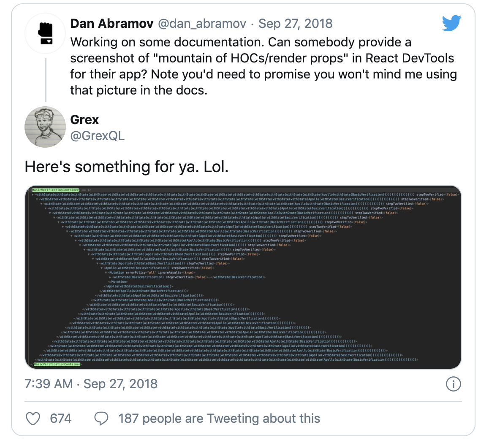

More lessons learned during a busy few months.

Part II in the [series](https://medium.com/@cp.vibert/software-engineering-at-eko-pandemic-edition-part-i-75b8f4f578e6).

> During the few months that I stood at my desk in the kitchen, I worked on 3 projects all with very different tech stacks. I wrote some good code and I wrote some bad code. I lost what feels like years of sleep, but more importantly, I gained what feels like years of experience.
> I want to share some of these experiences and pass on some useful tips that I picked up along the way.

## Build your own translation service

Before moving to Bangkok earlier this year, I’d never worked on an application that needed to support more than one language — hardcoding text in English was all I’d ever known.

At [Amity](https://amity.co/) we need to support many languages, and we do so mainly using the [react-intl](https://formatjs.io/docs/react-intl/) library. It’s simple to use, but until my second ‘pandemic project’, I’d never given much thought to how it works.

This second project was an application for Doctors to manage potential COVID patients (built with NextJS which I talk about in [Part I](https://medium.com/@cp.vibert/software-engineering-at-eko-pandemic-edition-part-i-75b8f4f578e6)). We knew that the application would have to support the Thai language eventually, but to get moving quickly we started off with just hardcoded English.

When the time for translation came, I took the same approach always:

This led me to more bug reports that I was expecting — many people were having trouble translating their NextJS apps with the popular libraries like [react-intl](https://formatjs.io/docs/react-intl/) and [react-i18next](https://github.com/i18next/react-i18next), mainly due to the server-side rendering (SSR) that comes with NextJS.

I found the [next-i18next](https://github.com/isaachinman/next-i18next) library which is specifically for NextJS and its SSR, but that required a custom Express server which we were intentionally avoiding in favour of [the far simpler API routes solution](https://medium.com/@cp.vibert/software-engineering-at-eko-pandemic-edition-part-i-75b8f4f578e6).

And so I decided to build my own. Doing so was a last resort, but given the immense time pressure, this last resort was reached quite quickly. Even my Sunday morning Git commits are evidence of the rush:

Building a translation service that matched our needs was relatively straightforward:

1. Detection of the user’s language — browser settings can provide an initial language with `window.navigator.language`, and localStorage can be used to save a preferred language.

1. A React context provider that stores the user’s current language along with a function to update this language. The function to update language is needed only by the ‘language picker’ component, and the language value itself is needed to ensure that our ‘translate’ function is outputting a string in the correct language. This translate function comes from…

1. A React hook to consume the current language from context and use it to provide a `translate` function to components. The function will take a translation key, and return the corresponding value from the relevant language object — if no value is found it’ll try the default language object, and if no luck here, it’ll simply return the key itself.

`gist:cpv123/c7e32ed6924c4358bafc00a67ad603d9#useTranslate.js`

Any component rendering a string that needs translation can use this hook to access the translate function:

`gist:cpv123/253081666d83f6fbfd648d9f6554c70d#ComponentUsingTranslate.js`

### Tips for translating apps

A general piece of advice: don’t let translation/localisation become an afterthought. If your app will need to be translated eventually, then you should build for this right from the start.

Even without any translation system in place, you can wrap text strings in a ‘dummy’ `translate` function:

    const translate = string => string

    {translate('This will be translated one day')}

This will allow you to later find the strings that require translation by searching for where this function is used. When the real translate function comes along — assuming it’s named the same — you can just replace these text strings with the corresponding key from the `translations` object.

## Rediscovering higher-order components in React

Since the release of [Hooks](https://reactjs.org/docs/hooks-intro.html), React applications have started to look very different. One of the main differences is that ‘with’ has been replaced by ‘use’ — by this, I mean that higher-order components have been replaced with hooks.

Both hooks and higher-order components (HOCs) allow you to extract common logic for reuse across multiple components. Whether or not hooks can and should completely replace HOCs is debatable, but the reality of it is that hooks are replacing HOCs. Think of all your favourite libraries and you’ll find that they’re probably now advocating the use of hook alternatives like `useSelector` and `useHistory`.

Despite this trend, the first of my three projects was working on an application using React 15 with no hooks but lots of HOCs — the application was built from functional components wrapped by HOCs from the [recompose](https://github.com/acdlite/recompose) library. This HOC-based architecture turned out to be a perfect solution to our requirement: to take the existing registration flow for Amity's Eko App and modify it so that with the help of a few environment variables, it could also act as the registration flow for a completely new app.

We knew that this would mean lots of conditional logic throughout the app:

    const variableToUse = config.isApplicationA ? variableA : variableB

where this `variableToUse` could be anything such as a page title, the current registration step number, or the URL of the next step in the registration flow.

Instead of having to write this line of code in each component, HOCs allowed us to:

1. Write it only once in a `withIsApplicationA` HOC

1. Keep all of the conditional logic outside of the components themselves — the components would receive these variables as props but without knowing how or where their values were derived

Point 2 was particularly important because we knew that eventually, the two registration flows may diverge enough to justify each having its own repository. If this time came, we could remove the conditional logic without having to interfere with the components themselves.

As the application progressed, these conditional variables became more complex. Soon, each of the registration flows was using a different set of backend APIs with very different response formats. This meant that the frontend needed a separate set of MobX store actions for each set of APIs. For example, the final registration request required a separate store action for each registration flow:

`gist:cpv123/3ff9f2d2f202e0f80aa87dc3e7d0fa4b#mobx-conditional-actions.js`

To handle this, we built the `WithConditionalRequest` HOC to inject the relevant store action as a prop into the wrapped component. It does this by:

1. Consuming the app’s MobX store and the app’s config — `inject('store', 'config')`

1. Using this config to determine the relevant app — `withIsApplicationA(config)`

1. Taking the two possible MobX actions from the store based on the function names passed as arguments (and checking that they actually exist)

1. Choosing the correct one of these two and passing it down as a prop named according to the `propName` argument

`gist:cpv123/a7b0b1f9c7754d7fb664260e666416f8#withConditionalRequest.js`

Using this conditional request HOC, along with many other HOCs both custom and from third-parties, we established a common shape for our components: small, functional, and injected with a few props dependent on which registration flow it was.

This pseudo example of the final registration step demonstrates shape. For the user, the final step looks nearly identical for each registration flow but has a different title and uses a different API for the registration request thanks to the `withAppName` and `withConditionalRequest` HOCs.

`gist:cpv123/f3568f21d888bb75509360994658642d#final-step-hocs.js`

The component itself remains very simple or ‘dumb’ — it doesn’t even know that it’s acting as a final step for two separate registration flows. This kind of simplicity cannot even be achieved using hooks.

Using hooks, this final step component would probably look something like this:

`gist:cpv123/1e130539d712814aa26429af85525272#final-step-hooks.js`

The conditional logic lives inside the component itself — the `withAppName` and `withConditionalRequest` hooks. If the time came to refactor and remove this logic, it would mean doing so within the components themselves.

Overall, this project was a refreshing reminder that there is still a place for HOCs in React applications, no matter what version of React is being used.

### Tips for using higher-order components

An undeniable downside of a HOC-based architecture is that you end up in ‘wrapper hell’. This is where components become so buried under layers of HOCs that your React DevTools and stack traces become meaningless.

<small><a href="https://twitter.com/dan_abramov/status/1045107407817461761?ref_src=twsrc%5Etfw%7Ctwcamp%5Etweetembed%7Ctwterm%5E1045110734550589441%7Ctwgr%5E&ref_url=https%3A%2F%2Fcdn.embedly.com%2Fwidgets%2Fmedia.html%3Ftype%3Dtext2Fhtmlkey%3Da19fcc184b9711e1b4764040d3dc5c07schema%3Dtwitterurl%3Dhttps3A%2F%2Ftwitter.com%2Fgrexql%2Fstatus%2F1045110734550589441image%3Dhttps3A%2F%2Fi.embed.ly%2F1%2Fimage3Furl3Dhttps253A252F252Fpbs.twimg.com252Fmedia252FDoD6dSSVAAAvdkO.jpg253Alarge26key3Da19fcc184b9711e1b4764040d3dc5c07">A great example of wrapper hell.</a></small>
 

To make this more manageable, add a display name to your custom HOCs. All the recompose HOCs will have this built-in, and recompose even offers methods to set display names yourself: `setDisplayName` and `wrapDisplayName`. It won't solve the problem, but it’ll alleviate some of the pain when debugging a stack trace.
